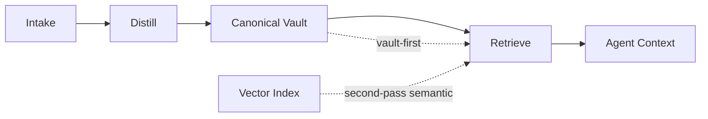

# TrustMem

Local-first memory for AI agents: distilled notes -> canonical Markdown vault (with backlinks), with deterministic scoping and hard safety defaults.

## What it does
- Stores distilled memory logs in `memory/*.md` (no raw chat by default).
- Generates and updates a canonical vault in `vault/` (human-editable Markdown, backlink-friendly).
- Enforces deterministic scoping (projects/people/roles) via `projects-map.yaml`.
- Ships safe-by-default: no shared API keys, secrets blocked, local-first defaults.

## Memory Flow


## Quickstart
```bash
./scripts/install.sh
./bin/trustmem doctor
```

## Requirements
- Linux/macOS recommended. Windows: WSL2 (or Git Bash-compatible environment).
- Dependencies: `bash`, `rg`, `awk`, `sed`, `node`

## Commands
```bash
./bin/trustmem doctor
./bin/trustmem remember "Important preference"
./bin/trustmem forget "stale item"
./bin/trustmem sync --rebuild
```

## Security
- Never commit `.env` or any real API keys.
- Default is local embeddings for OSS; remote embeddings require BYO key.

## NVIDIA Embeddings (OpenClaw)
`nv-embedqa-e5-v5` is dual-mode:
- indexing: `nvidia/nv-embedqa-e5-v5-passage`
- querying: `nvidia/nv-embedqa-e5-v5-query`

OpenClaw single-model embedding config cannot route index vs query correctly without provider or patch support.

## Repo Layout
Tracked: templates, examples, scripts, docs.
Untracked: `.env`, `projects-map.yaml`, `memory/`, `vault/`, `vault-backups/`.

> `examples/cursor.mcp.example.json` and `examples/claude-desktop.mcp.example.json` are placeholders until MCP server wiring is finalized.

## Development
### Included in this repo
- `.gitignore`
- `.gitattributes`
- `.env.example`
- `config.example.yaml`
- `projects-map.example.yaml`
- `projects/project.example.md`
- `examples/`
- `.github/workflows/ci.yml`
- `bin/trustmem`
- `scripts/doctor.sh`
- `scripts/install.sh`
- `scripts/memoryctl.sh`
- `scripts/vault_sync.sh`
- `ROADMAP.md`
- `LICENSE`
- `SECURITY.md`
- `CONTRIBUTING.md`
- `CHANGELOG.md`

### Local-only (not committed)
- `.env`
- `projects-map.yaml`
- `projects/*.md` (except `projects/project.example.md`)
- `memory/`
- `vault/`
- `vault-backups/`
